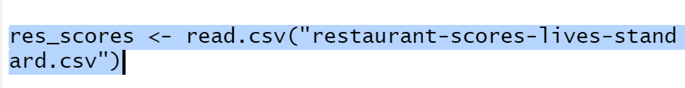
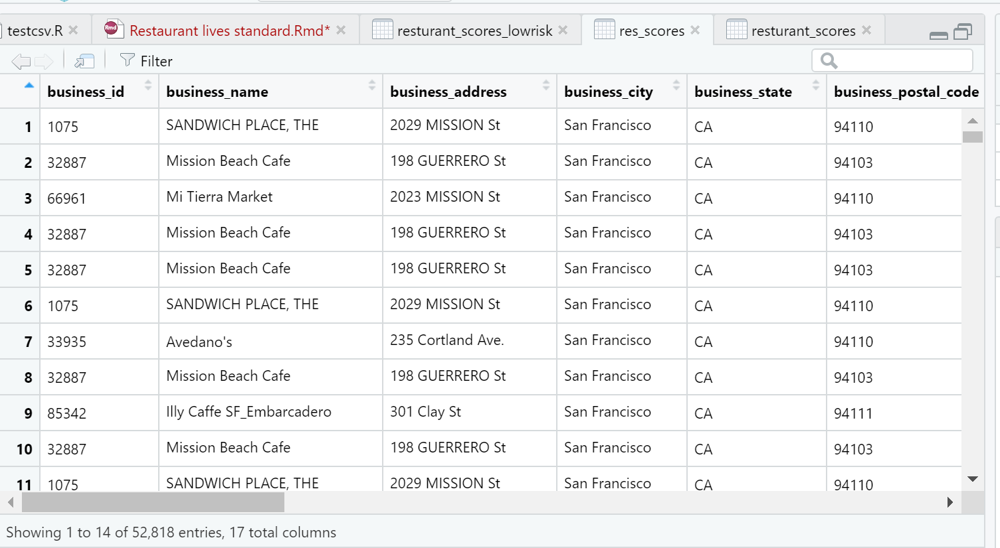

Prasyarat 
Hal yang diperlukan untuk menginstal perangkat lunak dan cara menggunakannya :
R Language
R Studio

Library yang dipakai dalam program ini :
library (ggplot2)
library (breakDown)
library (plotly)
library (tidyverse)
library (lubridate)
library (janitor)
library (ggplot2)

Berikut adalah langkah-langkah dalam menjalankannya :
Buka berkas dari disk drive yang sudah disimpan
Buka di aplikasi R Studio
Memasukan syntax dan metode-metode kodenya
Jalankan dan pilih Run Button di aplikasi R Studio tersebut

1.2 Detail Program   
Sistem program Restaurant Lives Standard yang kami buat menggunakan Bahasa pemrograman R dengan menggunakan software R Studio. Dengan adanya program Restaurant Lives Standard, diharapkan dapat memberikan gambaran mengenai standar nilai restoran yang ada di San Fransisco dan restoran mana saja yang mempunyai nilai risiko yang tinggi (buruk/high risk) atau justru nilai risiko yang rendah (baik/low risk), jadi dari sampel yang dibuat dari data yang telah kami dapatkan juga bisa ditarik kesimpulan mengenai nilai lives standard restoran yang ada di San Fransisco.

1.3 Proses Program
    Proses yang ada pada sistem program Restaurant Lives Standard ini mempunyai tujuan yang di mana nanti dapat terlihat ada berapa jumlah restoran yang masih belum mempunyai nilai baik (high risk/berisiko tinggi), dan diharapkan melalui data-data yang didapat nantinya bisa diaplikasikan pada berbagai tempat dan negara. 

Ada 3 proses yang penting dalam pembuatan program ini, yaitu :

Pengumpulan data
    Data dari restoran-restoran di seluruh tempat di San Fransisco dikumpulkan untuk dilihat data-datanya, dan begitu juga dengan data inspeksi yang dilakukan untuk menentukan restoran tersebut masuk ke golongan high risk(beresiko tinggi) atau low risk(beresiko rendah). 

     1.    Input data
    Data-data tersebut kemudian di-compile dan dimasukkan ke dalam excel.

     2.    Pengelompokkan data
    Data yang sudah dimasukkan ke dalam excel tersebut kemudian dijadikan bentuk csv, lalu dalam R studio kita memasukkan data-data tersebut agar dapat terbaca pada program yang akan kita jalankan nanti dan dapat dikelompokkan menurut kelompoknya masing-masing.

     3.     Pengelolaan data
    Data yang sudah dikelompokan akan diolah oleh R Studio, dengan memperhitungkan data-data yang sudah dimasukan. Setelah data diolah oleh R Studio hasil akan diberikan dalam bentuk grafik dan tabel perhitungan dengan standar yang sudah ditentukan.
    
    
2.1 Asumsi Data
-	Data (csv) yang merupakan kumpulan informasi dari setiap restoran di San Fransisco akan di-input. 
-	Setiap data yang ada mewakili golongan masing-masing, apakah restoran tersebut berada pada kelompok nilai low risk, high risk atau moderate risk.
-	Jika data sudah terinput nantinya setiap golongan akan digabungkan dengan golongannya masing-masing untuk dilihat angka dari tiap-tiap golongan. 
-	Setiap golongan akan menerima jumlah yang berbeda-beda.
			
2.2 Penjelasan

Gambar di atas merupakan contoh dari penerapan input data, data yang ingin kita masukkan adalah data Lives Scores Standard restoran-restoran yang ada di San Fransisco. Output-nya akan seperti :
 

Gambar di atas ini adalah output yang akan keluar jika kita mengakses code input dari data yang tersedia. 

code yang digunakan untuk mengelompokkan jumlah inspection score 

 Output yang keluar setelah code dijalankan, dapat dilihat jumlah restoran (n) dan nilai inspeksi yang mereka dapatkan (inspection_score). Setelah itu dapat dikelompokkan dari tiap-tiap golongan, dan berikut adalah golongan low risk :

 

dan berikut merupakan output dari code yang dijalankan :

 

 
dapat dilihat jumlah restoran (n) dan nilai inspeksi yang mereka dapatkan (inspection_score). Contohnya seperti terdapat 4 restoran yang hanya memiliki nilai 45  dalam inspection_scores dan termasuk low risk. Lalu dapat dilihat juga pengelompokkan golongan high risk adalah seperti berikut :

 

 

 

dapat dilihat jumlah restoran (n) dan nilai inspeksi yang mereka dapatkan (inspection_score). Contohnya seperti terdapat 5 restoran yang hanya memiliki nilai 45  dalam inspection_scores dan termasuk high risk. Lalu dapat dilihat juga pengelompokkan golongan moderate risk adalah seperti berikut :
 

 

 

dapat dilihat jumlah restoran (n) dan nilai inspeksi yang mereka dapatkan (inspection_score). Contohnya seperti terdapat 3 restoran yang hanya memiliki nilai 100 dalam inspection_scores dan termasuk moderate risk. Lalu dapat dilihat juga pengelompokkan golongan ketiganya :

 

 
 

Dapat dilihat bahwa data yang unggul dalam pengolahan data tersebut adalah kategori Low Risk, yang mencapai angka 19702 restoran.

Data (csv) yang merupakan kumpulan informasi dari setiap restoran di San Fransisco akan di-input. 
Setiap data yang ada mewakili golongan masing-masing, apakah restoran tersebut berada pada kelompok nilai low risk, high risk atau moderate risk.
Jika data sudah terinput nantinya setiap golongan akan digabungkan dengan golongannya masing-masing untuk dilihat angka dari tiap-tiap golongan. 
Setiap golongan akan menerima jumlah yang berbeda-beda.

Bisa dilihat bahwa hasil untuk model dan data dari tahun ke tahun mengalami kenaikan dalam kategori High Risk, meskipun tidak terdapat perbedaan yang terlalu jauh dibandingkan dengan kategori Low Risk dan Moderate Risk. Kiranya dengan adanya data-data ini dapat membuat nilai-nilai restoran lebih baik lagi kedepannya, karena hal tersebut merupakan hal yang penting bagi suatu negara.

